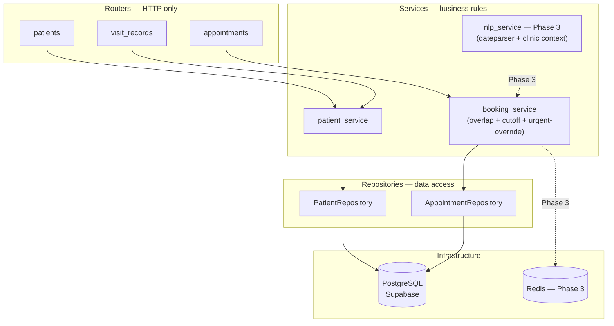

# Clinic Appointment Management System (AMS)

A production-grade appointment scheduling platform built for a real dental clinic — 2 dentists (orthodontist + periodontist) and 1 receptionist. Designed to free the front desk from manual scheduling and eliminate double-bookings, no-shows, and lost context between visits.

Built in Python (FastAPI) with PostgreSQL (Supabase), deployed on AWS EC2.

Current code state:
- DB read/write is live
- REST CRUD APIs are live
- Hardcoded role auth is live
- Jinja2 GUI is live
- Appointment prioritization is a lightweight, explainable scoring layer

**Live demo:** _link added after Phase 2 deployment_

---

## The Problem

A real clinic, running entirely on a paper diary, faces three recurring pain points:
- **No-shows** with no system to track or act on them
- **Prioritization** — urgent cases and in-treatment patients are indistinguishable on a list
- **Concurrent bookings** — a walk-in and a phone call can collide with the receptionist handling both

This system solves the first two structurally (status tracking, urgency overrides, visit history) and the third at the database level (an overlap exclusion constraint that holds regardless of which code path triggers a booking).

**What it doesn't solve:** It doesn't guarantee patient satisfaction, prevent last-minute cancellations, or replace the receptionist — it redirects her to higher-value tasks.

---

## Architecture

Three-layer, modular monolith. One-directional dependency: routers → services → repositories → database. No circular imports, no business logic in routers, no SQL in services.

```
┌──────────────────────────────────────────────────────┐
│  Browser  (staff GUI — patient / receptionist / doctor) │
└──────────────────────┬───────────────────────────────┘
                       │ HTTPS
┌──────────────────────▼───────────────────────────────┐
│  EC2 instance (Ubuntu t3.micro)                      │
│  ┌─────────────┐    ┌────────────────────────────┐   │
│  │ Nginx       │───▶│ FastAPI (Uvicorn workers)  │   │
│  │ :443 → 8000 │    └────────────────┬───────────┘   │
│  └─────────────┘                     │               │
└─────────────────────────────────────-│───────────────┘
                                       │ TLS connection
                       ┌───────────────▼────────────┐
                       │  PostgreSQL (Supabase)      │
                       │  + pgvector (Phase 3 RAG)   │
                       └────────────────────────────┘
```

**SOLID/GRASP compliance (lightweight — no over-abstraction):**
- Routers = GRASP Controller. Parse request → call service → return response. Nothing else.
- Services = Single Responsibility. `booking_service` owns the two booking rules: overlap check (DB constraint) and 8:30 PM cutoff (app code). Nothing else touches these rules.
- Repositories = Protected Variations. The only layer that knows it's Postgres. Phase 3 Redis caching slots into `booking_service`'s read path without touching repositories or routers.
- No abstract interfaces or ABCs preemptively — add them when a test or a second implementation actually requires one.



---

## Database Schema

### Active in Phase 1
`patients`, `doctors`, `appointments`, `visit_records`

### Present in schema, inactive until later phases
`invoices`, `payments` — dormant SQL only, no API surface until Phase 3+

### Key design rules (do not violate in later phases)
- Store `date_of_birth`, never a static `age` — age is computed on read via `AGE(CURRENT_DATE, dob)`
- `num_of_prev_visits` is never stored — always derived: `COUNT(*) FROM appointments WHERE patient_id = X AND status = 'completed'`
- No hard deletes on any medical or financial record — appointments "deleted" = status `cancelled`; patients "deleted" = soft deactivation flag
- Double-booking guarantee lives in the **database** (exclusion constraint), not application code — it holds regardless of code path

### Double-booking constraint
```sql
CREATE EXTENSION IF NOT EXISTS btree_gist;

ALTER TABLE appointments
  ADD CONSTRAINT no_overlap_for_regular_bookings
  EXCLUDE USING gist (
    doctor_id WITH =,
    tsrange(scheduled_start,
            scheduled_start + (duration_minutes * interval '1 minute')) WITH &&
  )
  WHERE (is_urgent_override = false AND status <> 'cancelled');
```

Urgent-override bookings (`is_urgent_override = true`) are invisible to this constraint — they can occupy an already-taken slot, left to the doctor's in-person discretion. The 8:30 PM cutoff, however, has no override and lives in `booking_service`.

---

## Roles

| Role | What they can do |
|---|---|
| **Patient** | View own appointments, cancel own appointment, see report requirements |
| **Receptionist** | Book / reschedule / update appointments, create patients, manage the queue |
| **Doctor** | Everything the receptionist can + override priority, mark urgent-override, complete clinical records |

The clinic currently runs with hardcoded credentials for the 3 roles. That keeps the MVP deployable without user accounts while still enforcing role separation.

---

## Clinic Schedule (hardcoded for Phase 1, configurable in Phase 2)
- Weekdays only (Mon–Fri) until weekend schedule is confirmed with the clinic
- Clinic opens effectively at 17:00, last bookable slot at 20:30
- "This evening" in NLP context (Phase 3) = 17:00–20:30 window

---

## Tech Stack

| Layer | Choice | Why |
|---|---|---|
| Backend | FastAPI + Uvicorn | Lightweight EC2 footprint; best Python ecosystem alignment for Phase 3 ML/RAG; auto-generated OpenAPI docs accelerate Phase 1 testing |
| Database | PostgreSQL via Supabase | `btree_gist` (overlap constraint) + `pgvector` (Phase 3 RAG) both confirmed available; managed hosting removes a self-hosted process from EC2 |
| ORM | SQLAlchemy (async) | Pairs naturally with FastAPI; Alembic migrations |
| Auth | fastapi-users (Phase 2) | JWT + role-based access without abandoning FastAPI |
| Frontend | React + Tailwind (Phase 2) | Phase 1 ships Jinja2 templates for speed; replaced with proper SaaS-look UI in Phase 2 |
| NLP (Phase 3) | `dateparser` + clinic context dict | "13th of this month" / "this evening" → datetime. No LLM needed for date parsing. |
| Deployment | AWS EC2 (Ubuntu) + Nginx | Industry signal for a job-hunting graduate; Nginx handles TLS termination and reverse proxying |

---

## Phased Roadmap

All paths must be independently demoable at their endpoint:
`P1 → P4`, `P1 → P2 → P4`, and `P1 → P2 → P3 → P4` are all valid stopping points.

| Phase | Scope | Exit criteria |
|---|---|---|
| **0** | Planning, stack, schema, system design | ✅ Done |
| **1** | PostgreSQL schema live on Supabase + REST CRUD endpoints (patients, appointments, visit_records) + Jinja2 click-button GUI + hardcoded auth | Working end-to-end: create a patient, book an appointment, see it in the dashboard, mark it completed. Overlap constraint enforced. |
| **2** | JWT auth + role enforcement (patient / receptionist / doctor) + React + Tailwind frontend + automated tests (pytest) + live URL on EC2 | **Demoable, secure, presentable CRUD project.** This is the resume checkpoint. |
| **3** | `dateparser`-based NLP booking input + Redis caching for slot reads + analytics dashboard (no-show patterns, busy hours) + DPDP compliance basics | NLP feature has a test suite, not just "it runs." |
| **4** | Dockerization + GitHub Actions CI/CD + hardened production deployment | Push-to-main triggers test + deploy. |

---

## API Surface (Phase 1)

| Resource | POST | GET | PUT | DELETE |
|---|---|---|---|---|
| `/patients` | Create | List (search) / `/{id}` | `/{id}` update | `/{id}` soft-deactivate |
| `/appointments` | Book (runs overlap + cutoff check + priority score) | List (filter by date/doctor/status) / `/{id}` | `/{id}` reschedule, status change, or priority update | — (use PUT status=cancelled) |
| `/visit_records` | Create on appointment completion | List / `/{id}` | `/{id}` edit notes | — never |
| `/doctors` | — (seeded via migration) | List | — | — |

---

## Project Structure

```
clinic-ams/
├── app/
│   ├── main.py
│   ├── core/
│   │   └── config.py
│   ├── db/
│   │   ├── session.py
│   │   └── base.py
│   ├── models/
│   │   ├── patient.py
│   │   ├── doctor.py
│   │   ├── appointment.py
│   │   └── visit_record.py
│   ├── schemas/
│   │   ├── patient.py
│   │   ├── appointment.py
│   │   └── visit_record.py
│   ├── routers/
│   │   ├── patients.py
│   │   ├── appointments.py
│   │   └── visit_records.py
│   ├── services/
│   │   ├── booking_service.py
│   │   └── priority_service.py
│   ├── repositories/
│   │   ├── patient_repository.py
│   │   └── appointment_repository.py
│   └── templates/
│       ├── base.html
│       ├── dashboard.html
│       ├── book_appointment.html
│       └── patient_search.html
├── alembic/
│   └── versions/
├── tests/
├── seed_demo_data.py
├── requirements.txt
├── .env.example
└── README.md
```

## Demo Data

Run the demo seed script after migrating the database:

```bash
python seed_demo_data.py
```

It seeds:
- Two dentists: periodontist + orthodontist
- Several dummy patients
- Completed historical visits for at least one regular patient
- Upcoming appointments with varied severity, urgency, and treatment phase
- Report requirements such as x-ray and blood test prerequisites

If you use the patient login path, enter the patient ID shown by the seed script. The app also supports `DEMO_PATIENT_ID` in `.env` for a default patient login fallback.

## Appointment Prioritization

The current prioritization layer is intentionally simple so it can ship cleanly:

- New vs established patient
- Completed visit history
- Severity and urgency labels set by staff
- One-time vs phased treatment
- X-ray / blood test report requirements
- Doctor urgent override

Priority is stored on each appointment as:
- `priority_score`
- `priority_band`
- `priority_summary`

That keeps the scheduling logic explainable while leaving room for a more advanced ML classifier later.

---

## Open Decisions (resolve before writing related code)

- Per-sitting vs. per-treatment-course invoicing — ask the clinic. Defer until Phase 3.
- Weekend schedule — confirm with clinic before implementing slot availability for Sat/Sun.
- Fixed vs. variable appointment duration — `duration_minutes` on the schema supports either. Default 20 min for Phase 1.
